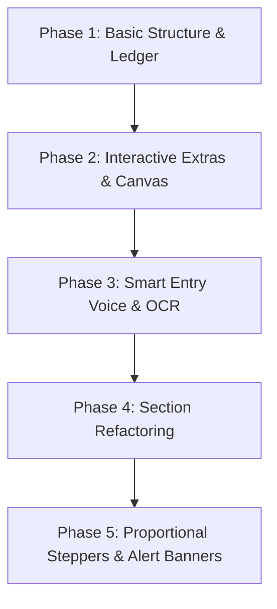

# 🍽️ QuickSplit Pro

QuickSplit Pro is a premium, client-side group bill-splitting utility featuring glassmorphic aesthetics, smart entry modes, and proportional unequal share calculations. It facilitates group dining settlements by integrating client-side speech recognition, OCR camera receipt parsing, and greedy debt-simplification algorithms.

---

## 🚀 Key Features

*   **🎙️ Voice Input (Speech-to-Text)**: Speak line items naturally (e.g., *"Burger ninety-nine"* or *"Garlic Bread two hundred rupees"*). Fills item details automatically.
*   **📸 Client-side OCR Bill Scanner**: Snap a picture of a receipt using the environmental camera stream or upload a file. `Tesseract.js` extracts line items and prices client-side for review before import.
*   **⚖️ Proportional Share Splitting (Unequal portions)**: Distribute item portions using a stepper selector `[ - ] Qty [ + ]` under each friend card. Portion splits calculate proportionally in real-time.
*   **👥 'Split Equally' Quick Action**: Click the group icon next to any item in the ledger list to instantly split it equally among all active friends (assigning 1 unit to each). Click again to clear the split.
*   **⚠️ Dynamic Allocation Alert Banners**: An interactive warning banner lists all under-assigned quantities (e.g., `⚠️ Unassigned: 1x Idli`). When allocations are complete, a green success banner appears (`All dishes fully assigned! 🎉`).
*   **💳 Payments & Interactive Debt Settler**: Log manual payments or split remaining balances equally. A greedy debt simplification algorithm computes optimal, minimized peer-to-peer transfers. Includes detailed calculation math tooltips and interactive checkmarks to check off settled transactions in real-time.
*   **🖼️ Torn-Paper Canvas Exporter**: Renders and downloads a stylized paper-style receipt image outlining the brand, subtotals, tax/service rates, and individual shares as a PNG.
*   **🎨 Premium Dual-Theme System**: Harmonious color palettes in dark (default) and light themes with avatar color-cycling.

---

## 🛠️ Technology Stack

1.  **Frontend**: HTML5, Vanilla JavaScript (ES6+), Vanilla CSS (Flexbox, Grid, custom properties, custom animations).
2.  **OCR Processing**: `Tesseract.js` (v5) hosted via jsdelivr CDN.
3.  **Voice Recognition**: Web Speech API (`SpeechRecognition` / `webkitSpeechRecognition`).
4.  **Receipt Rendering**: Canvas 2D API.
5.  **State Management**: `localStorage` automatic state synchronization and cache parsing.

---

## 📝 Step-by-Step Implementation Workflow

The project was built sequentially across the following phases:



### Phase 1: Foundation & Core Ledger Layout
*   Established custom CSS properties (colors, gradients, glassmorphism filters, theme constants) inside `styles.css`.
*   Created a responsive grid structure separating inputs and calculations.
*   Implemented friends management, basic item addition, and a basic tax/tip calculation engine.

### Phase 2: Interactive Features & Image Exporter
*   **Inline Editing**: Added a pencil icon on ledger rows, changing the add form to an "Update" form to modify items without losing original assignments.
*   **Preset Fast Toggles**: Introduced quick percentage selectors (5%, 12%, 18%, 28%) that update input values and trigger calculations automatically.
*   **PNG Exporter**: Built a Canvas 2D renderer to generate a receipt layout (using a retro-styled torn-paper bottom border) and download it directly.
*   **Avatar Cycles**: Allowed clicking friend badges to cycle their avatar background color indices.
*   **Debt Settler Expansion**: Built an interactive settlement accordion showing detailed proportional subtraction calculations.

### Phase 3: Smart Entry Engine (Voice & OCR)
*   **Web Speech Integration**: Connected the Web Speech API with regular expressions to filter voice commands and isolate item names from prices.
*   **Tesseract OCR Modal**: Integrated client-side OCR. Added file drop overlays, video capture stream permissions for camera scanning, extraction loading screens, and a checklist preview to select valid items.

### Phase 4: Workflow Refactoring
*   Redesigned the cards to run in a step-by-step layout inside the Left Column:
    1.  **1. Add Friends**: Register names.
    2.  **2. Add Items**: Input dishes (without assignee check boxes).
    3.  **3. Assign Shares**: Expand friend cards to assign portions.
    4.  **4. Add Tax & Service Charge**: Turn on/off service charge and adjust taxes.
*   The Right Column displays purely output values: **Added Items**, **Payments & Settlement**, and **Split Summary**.
*   Converted the Service Charge checkbox to a native switch button.

### Phase 5: Proportional Steppers & Alert Banners (Current)
*   Converted the `item.assignees` array to an object mapping friend names to claimed quantities.
*   Implemented proportional share allocation:
    $$\text{Friend's Share} = \left( \frac{\text{Friend's Claimed Qty}}{\text{Total Claimed Qty}} \right) \times \text{Item Total Cost}$$
*   Replaced checkboxes under friend cards with custom stepper controls (`btn-stepper`, `stepper-value`) that limit claimed quantities based on the item's total quantity.
*   Added the unassigned warning alert banner at the top of Section 3 to track under-allocated items.
*   Implemented a "Split Equally / Assign to All" quick-action toggle button inside each ledger item row to automatically distribute 1 portion to all active friends or clear allocations instantly.

### Phase 6: Session History & Settlement Checkmarks
*   Added local storage-based history caching supporting multiple parallel split sessions (snapshots of items, friend settings, rates, currency choices).
*   Integrated settlement checkmarks next to peer debt instructions. Checked rows visually fade out and strike through, persisting dynamically across reloads.

---

## 🛠️ How to Run Locally

Since browser camera streams and speech recognition APIs are blocked on the file system (`file://` protocol), **QuickSplit Pro** must be loaded over a local server:

1.  **Start a local server**:
    ```bash
    # Python 3
    python -m http.server 8000
    
    # or Node.js (http-server)
    npx http-server -p 8000
    ```
2.  Open **`http://localhost:8000/day-1/`** in your web browser.
3.  Ensure microphone and camera permissions are granted when prompted.

---

## ⚖️ License & Legal Ownership

**Copyright © 2026 Arisudan. All Rights Reserved.**

This software and its associated source code, design elements, and documentation are the sole legal property of **Arisudan**. The owner holds all legal rights, titles, and interests in and to this project legally.

No part of this repository may be reproduced, distributed, or transmitted in any form or by any means, including photocopying, recording, or other electronic or mechanical methods, without the prior written permission of the legal owner.
